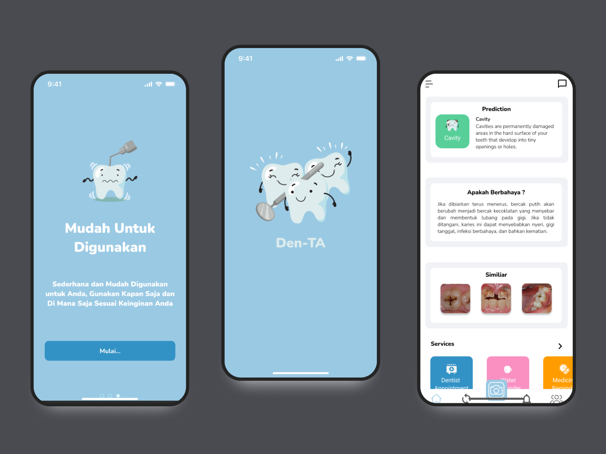

<!-- PROJECT LOGO -->
 

  <h3 align="center">Dent-TA</h3>

  

    An application to detect teeth dissease using Smartphone Android
     
    <a href="https://www.youtube.com/watch?v=b02cU1wFW0k" target="_blank">View Demo</a>
    ·
    <a href="mailto:yulfisahsan@gmail.com">Report Bug</a>
    ·
    <a href="mailto:yulfisahsan@gmail.com">Request Feature</a>
  

## About The Project
This is Final Project to fulfill the requirements to take and finish Bachelor's Degree in Institut Teknologi Telkom Purwokerto.

  

Health is a very important aspect In human life, one of them is dental health. Access of examination for prevention and dental treatment still lacking and limited in various regions, it is proven from the prevalence of oral disease continues to grow. Riset Kesehatan Dasar in 2018 conduct a survey with a sample of 300.000 households, noting that the largest proportion of health problems in Indonesia is a oral disease with the proportion of dental and oral problems by 57,6% and only 10,2% receiving health services. Android-based application will created using Scrum method to help detect dental disease by using smartphone camera, which can be done personally so that can help public to diagnoses early symptoms of dental disease before cosulting with dentist. The result of this research indicate that the Scrum method can be implemented in the application, the application’s interface can communicate effectively with each other, and the application features performing well, based on the result of UI and Black Box Testing, including Compatibility Test and System Usability Scale (SUS), these test to ensure that the overall functionality operates smoothly, with an average SUS score is 73  in the range of API 24 to API 33.

Features :
* Early scanning oral disesae
* Daily treatment & medicine reminder

##### Notes  
* This Final Project focusing on building application, for the Machine Learning or AI i'm using from the my friend's Final Project Andre Citro Febrilian Lanyak
* This app project case is from my previous program in Merdeka Belajar Kampus Merdeka (MBKM) Bangkit 2022. I have asked the Capstone Group, MBKM Mentor, MBKM Facilitator, for permission to take this Captone Project for my Final Project.  

**Special Thanks For MBKM Capstone Group**  
 - [A.Aksa Nur Irwan](https://github.com/aaksa) - Universitas Muslim Indonesia
 - [Andre Citro Febriliyan Lanyak](https://github.com/andretkj1) - Institut Teknologi Telkom Purwokerto
 - [Muhammad Rahaji Jhaerol](https://github.com/rhjhaerol) - Institut Teknologi Telkom Purwokerto
 - [A. Muh. Fitrah Asfar](https://github.com/AMuhFitrahAsfar) - Universitas Muslim Indonesia
 - [Muhammad Zulfikar Novaly Rahman](https://github.com/novaly479) - Politeknik Negeri Ujung Pandang
